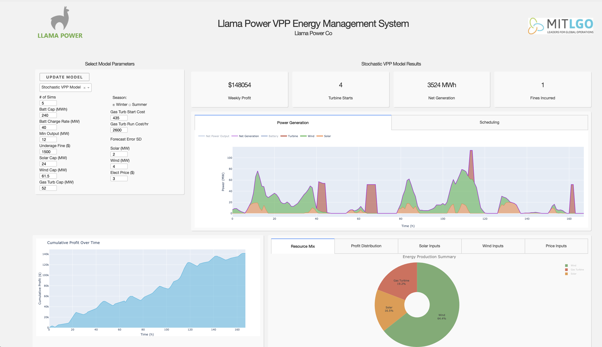

### VPP Optimization Model

- Models Virtual Power Plant based on commercial-scale battery storage system, PV, wind, and gas turbine peaker plant
- Modeled off of existing assets in southern california, size selected appropriately for efficient savings through combining
- 4 Optimization models to run: with/without battery and stochastic/non-stochastic model optimization
- Adjustable parameters for majority of problem definition inputs, as well as asset sizing
- Gurobi-based optimization (requires license)

